<div align="center">

# Bitling

**A desktop pet for macOS that lives on your dev activity.**

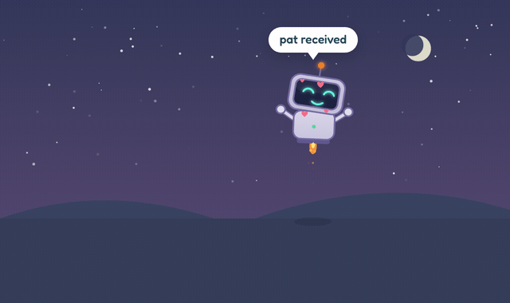

### ▶ [Play with it in your browser](https://jadhavgaurav.github.io/bitling/)

No install, no signup. Unbox it, pat it, throw it, and press the buttons to fire real
developer events at it.

[](https://github.com/jadhavgaurav/bitling/releases/latest)
[](https://jadhavgaurav.github.io/bitling/)


A small robot stands on the bottom edge of your screen, watches your cursor, walks around,
and reacts to what you are actually doing: your commits, your test runs, your deploys and
your Claude Code sessions.

</div>

---

## Try it without installing anything

**[jadhavgaurav.github.io/bitling](https://jadhavgaurav.github.io/bitling/)** runs the whole
creature in your browser. Tap the box to unbox it, pat it, drag it, throw it, and use the
**Try it** row to fire real developer events at it: commit, push, merge, rebase, failing
tests, passing tests, a deploy, a Claude Code session. Everything the desktop app does to the
pet itself, minus the parts that need your actual repositories.

## Install

```bash
curl -fsSL https://raw.githubusercontent.com/jadhavgaurav/bitling/main/install.sh | bash
```

That downloads the latest release, installs it to `/Applications`, links the `bitling`
command and opens it. Nothing to click through. ([Read the script first](install.sh) if you
would rather see what it does.)

Bitling puts an icon in the Dock: click it to open the control room. There is also a
smiling face in the menu bar. If you would rather it stayed out of the way, turn off
**Show in the Dock** in the control room's Setup tab and use the menu bar instead.

<details>
<summary><b>Prefer to download the .dmg by hand?</b></summary>

Grab it from the [releases page](https://github.com/jadhavgaurav/bitling/releases/latest),
open it, and drag **Bitling** into Applications.

macOS will then refuse to open it: **"Apple could not verify Bitling is free of malware."**
That is Gatekeeper reacting to an app signed ad hoc rather than with a paid Apple Developer
ID, which this one is. Nothing is wrong with the app, but macOS cannot tell.

**Click `Done`, never `Move to Trash`.** Then either:

- open **System Settings → Privacy & Security**, scroll down to "Bitling was blocked to
  protect your Mac", and click **Open Anyway**, or
- run this once:

```bash
xattr -dr com.apple.quarantine /Applications/Bitling.app
```

The one-line installer above exists precisely so you can skip all of that.

</details>

---

## Meet Bitling

<table>
<tr>
<td align="center" width="33%">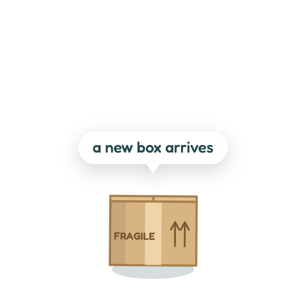<br><b>It arrives in a box</b><br>Tap it three times to unbox.</td>
<td align="center" width="33%">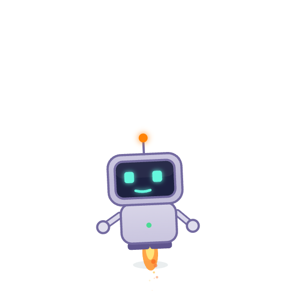<br><b>It flies</b><br>Off to hover somewhere else, then back.</td>
<td align="center" width="33%">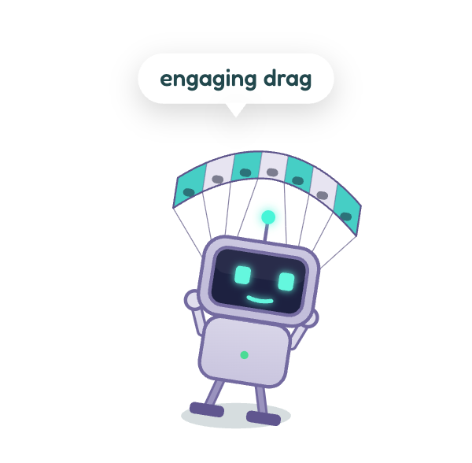<br><b>Throw it</b><br>It deploys a parafoil on the way down.</td>
</tr>
<tr>
<td align="center">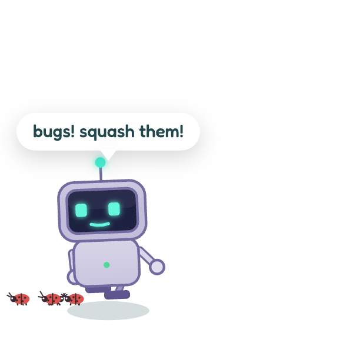<br><b>Bug hunting</b><br>It stomps them. So can you.</td>
<td align="center">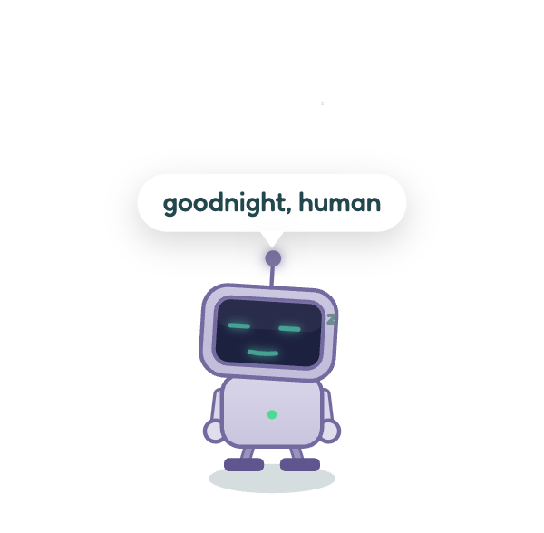<br><b>It sleeps</b><br>And wakes up for a commit.</td>
<td align="center">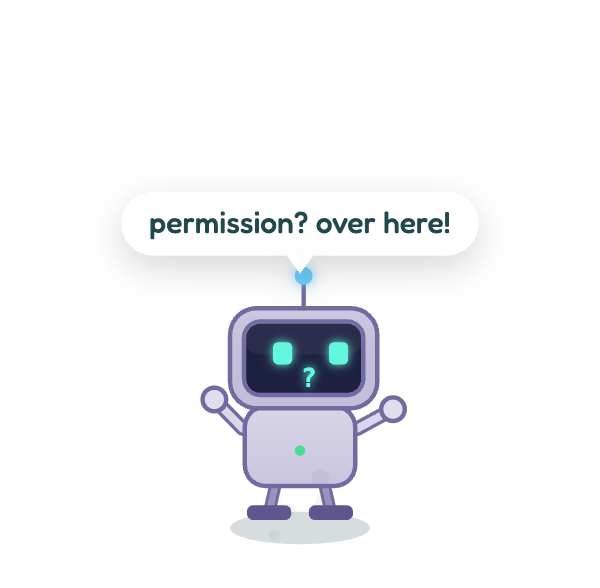<br><b>It waves</b><br>When something needs you.</td>
</tr>
</table>

Its screen is its face: pixel eyes that follow your cursor, a spinner while it works, a
progress bar while a deploy runs. The antenna changes colour with its mood. The three LEDs
on its chest are its needs. It has around 390 things to say, drawn so the same line never
lands twice in a row.

---

## It reacts to your git activity

<table>
<tr>
<td width="50%" align="center">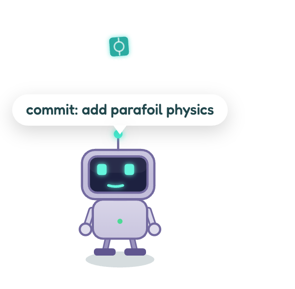</td>
<td width="50%" align="center">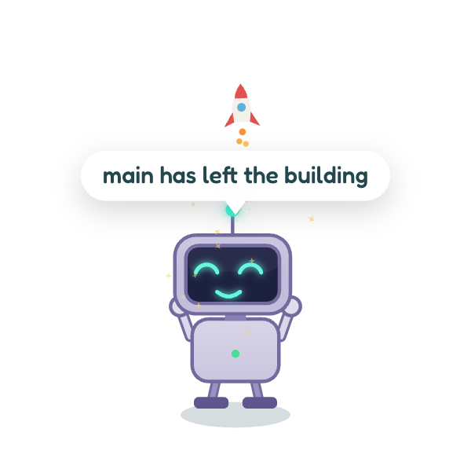</td>
</tr>
<tr>
<td align="center"><b>A commit drops a node it catches and eats</b></td>
<td align="center"><b>A push launches a rocket</b></td>
</tr>
</table>

Bitling watches **every repository on the machine**, with nothing to configure. It finds
them by scanning your home folder and any mounted volumes, then tails each repository's
reflog, so reactions land within about two seconds without ever running `git status` in a
loop.

| You do | Bitling does |
|---|---|
| commit | catches a falling commit node stamped with the short hash, and eats it |
| commit saying "fix" or "bug" | a beetle appears and gets stomped |
| commit saying "wip" | "wip. bold of you to admit it" |
| commit over 400 changed lines | "chonky commit!" |
| a very short message | asks whether that was really the message |
| commit after 23:00 | "go to sleep, human" |
| push | launches a rocket, "main has left the building" |
| merge | confetti, and it eats a purple merge node |
| checkout | glances around, "we live on feature/x now" |
| rebase, then finish | spinning dizzy eyes, then relief |
| pull, stash, reset, cherry-pick | a line for each |
| 10 or more uncommitted files | nags now and then |
| no commit all day | "git log is lonely" |

Optional **global git hooks** make it instant instead of near-instant. The menu bar item
points git's global `core.hooksPath` at a small folder of its own, and every hook there runs
your repository's own hook straight afterwards, so husky and friends keep working.
Disconnecting puts the setting back.

---

## It reacts to tests and deploys

<table>
<tr>
<td width="33%" align="center">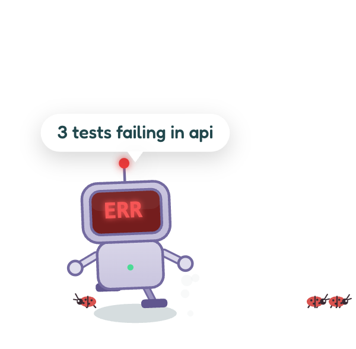<br><b>Tests fail</b></td>
<td width="33%" align="center">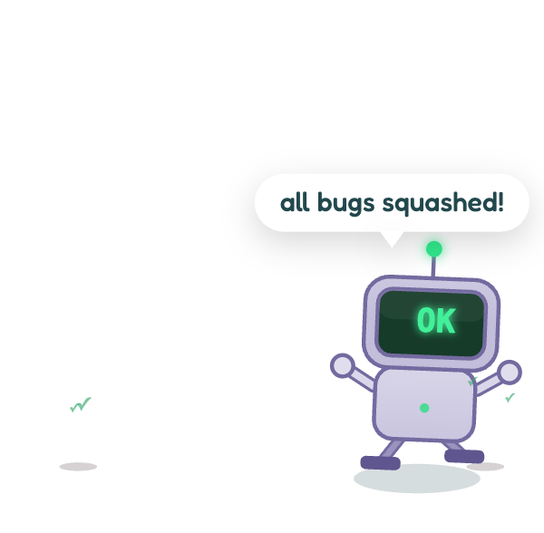<br><b>Tests pass</b></td>
<td width="33%" align="center">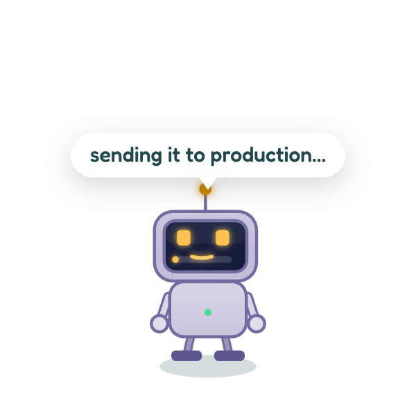<br><b>A deploy runs</b></td>
</tr>
</table>

When tests fail its screen goes red, its eyes become crosses, and it shakes. A deploy fills
a progress bar on its screen and ends in a rocket, or in smoke and "rollback time".

## Your whole screen is the stage

<div align="center">
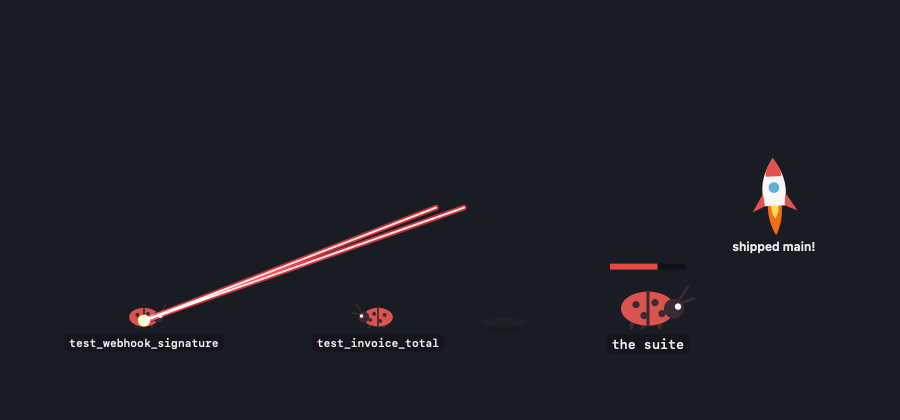
</div>

A failing test suite does not stay politely inside the pet's little window. The beetles
crawl out across your **entire screen**, over your editor and your browser, and **each one
wears the name of the test that is failing**. You can read what is broken without opening CI.

The pet turns, charges its eyes red, and fires twin laser beams across the desktop.

**It only shoots the ones you have actually fixed.** A beetle stands for a currently failing
test, so it stays there, crawling around, until that test passes. Run the suite again and the
pet vaporises exactly the beetles whose tests now pass, and leaves the rest alone. Go green
and it clears the board in a volley. Scorch marks fade where they fell.

A badly failing run sends out a boss instead: bigger, armoured, with a health bar equal to the
number of failures, whittled down as you fix them. A push launches the rocket up the full
height of your screen rather than fading at the top of a small window.

None of this can be clicked. The overlay never accepts a mouse event, so it cannot steal a
click or block anything you are working in, and it disappears completely when there is
nothing to draw. Turn it off with **Let bugs loose on the screen** in the menu and everything
stays inside the pet's own window, where it stomps and lasers as before.

Three sources feed this, all optional:

1. **GitHub Actions and GitHub Deployments** through the `gh` CLI, for any watched repo whose
   origin is on github.com. Run `gh auth login` once. Workflows named deploy, release,
   publish, cd or rollout count as deploys; the rest count as tests. Vercel and similar
   services record GitHub Deployments, so those appear too.
2. **Local pytest runs**, detected from `.pytest_cache`, including the failure count and the
   names of the failing tests, which is what the beetles wear.
3. **The `bitling` command**, for everything else.

```bash
bitling run npm test                    # reports pass or fail, keeps the exit status
bitling run pytest -q
bitling deploy production ./deploy.sh   # start, then finished or failed
bitling event test-failed count=3 name=api tests=test_alpha,test_beta,test_gamma
bitling say "lunch?"
bitling panel                           # open the control room
```

The command talks to the app over a `bitling://` URL, so it works from any shell, Makefile,
npm script or git hook. If the installer could not link it for you:

```bash
sudo ln -sf /Applications/Bitling.app/Contents/Resources/bitling /usr/local/bin/bitling
```

(The one-line installer does this for you when `/usr/local/bin` is writable.)

---

## It reacts to your Claude Code sessions

<table>
<tr>
<td width="50%" align="center">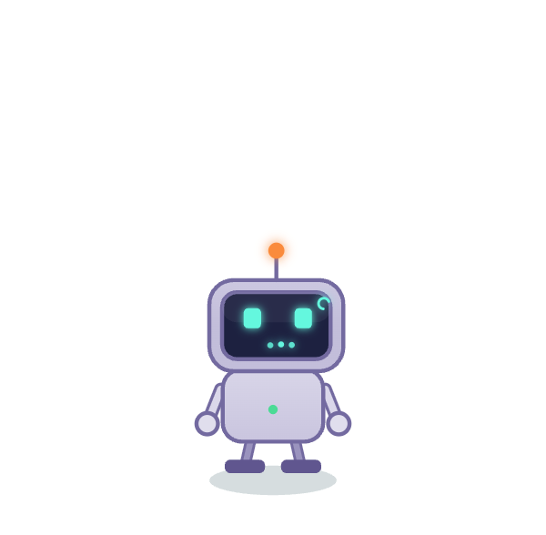</td>
<td width="50%" align="center"></td>
</tr>
<tr>
<td align="center"><b>Typing dots while Claude works</b></td>
<td align="center"><b>A wave when it needs your permission</b></td>
</tr>
</table>

This needs no configuration either: Bitling tails the session transcripts Claude Code writes
under `~/.claude/projects`, so it works with the terminal, the desktop app and the IDE
extensions.

| Claude Code | Bitling does |
|---|---|
| you send a prompt | "on it", antenna turns amber, typing dots, it stops strolling and stares at the code |
| it edits, runs, reads, searches | occasional chatter: "editing files…", "running tests…", "reading around…" |
| a tool call errors | a brief flicker, "well, that failed" |
| it finishes a turn | "over to you", sparkles, arms up |
| it waits for your permission | waves both arms, "?" on screen, and a chime |
| a session starts, idles or ends | a line for each |

Connecting the optional **Claude Code hooks** from the menu makes reactions instant and is
what enables the permission wave. It merges into `~/.claude/settings.json`, keeps your other
hooks, writes a backup next to the file, and removes only its own entries when disconnected.

---

## Care and feeding

Click to pat it. Drag to carry it: its legs dangle, and if you throw it, it tumbles, opens a
parafoil and lands on its feet. Feed it batteries, chips and cookies. Send it bug hunting.
Let it sleep.

It grows through three stages with age and care: **Bootling**, then **Bitling**, then
**Overclocked Bitling** with two antennas and a halo. Its needs drift while the app is closed,
capped at twelve hours. It never dies. It only sulks.

The menu bar holds the full set: the three meters, Pat, Feed, Debug bugs, Sleep, Hide,
Bring pet to this screen, Rename, Sound, Start over, Open at login, and a Dev activity
submenu with what is being watched, today's counts, and "Pretend…" items to see any reaction
on demand.

---

## The control room

Click Bitling's Dock icon, or right click the pet, or use the menu bar, and pick **Control
room**. `bitling panel` opens it from a shell. It answers "what has this thing actually seen
today?".

**Activity** holds a live portrait of your pet, blinking, dozing or thinking in orange while
Claude works, with its name, stage, age and three gauges. Under it: today's commits, pushes,
prompts and tool calls, a twelve-hour timeline where every event is a tick coloured by what
it was, and the stream itself, every commit subject, push, merge, failing suite, deploy and
Claude turn in the order they happened. The stream survives a restart, and "Start over" wipes
it along with the pet. Pat, Feed, Debug and Sleep sit along the bottom.

**Setup** is everything the menu used to bury: how many repositories are being watched and a
rescan, extra folders outside home, whether GitHub Actions is reachable, how many Claude Code
sessions are open, switches for the global git hooks, the Claude Code hooks and the
screen-wide bug swarm, and the pet's own name, sound, open at login, hide and start over.

Nothing in it phones home. Every number comes from the same watchers the pet reacts to, and
the window loads no fonts, scripts or images from the network.

## What connects to where

Worth being explicit, because a pet that reads your git history should be easy to reason
about:

- **git needs no account.** Bitling reads `.git/logs` on your own disk. No token, no OAuth,
  no network call, no GitHub. It works offline and on repositories that were never pushed
  anywhere. This is the whole git feature.
- **GitHub Actions and Deployments** are the one part that talks to GitHub, and they borrow
  the `gh` CLI's existing login rather than asking for a token of their own. No `gh`, no
  login, or a repo whose origin is not github.com: that one feature stays off and the
  control room says so. Everything else keeps working.
- **Claude Code** is read from the transcript files Claude Code already writes locally, plus
  optional hooks in your own `~/.claude/settings.json`.

---

## Build from source

Requires macOS 13 or newer and the Xcode Command Line Tools (`xcode-select --install`).

```bash
git clone https://github.com/jadhavgaurav/bitling.git
cd bitling
./build.sh
```

That derives the pet page, compiles a universal binary, draws the icon, ad-hoc signs the
bundle, installs `/Applications/Bitling.app`, and links the `bitling` command. Use
`INSTALL=0 ./build.sh` to build without installing, or `NATIVE=1` to skip the second
architecture while developing.

```bash
./release.sh              # build/Bitling-<version>.dmg
./release.sh --publish    # tag, push and create the GitHub release
```

Pushing a `v*` tag runs `.github/workflows/release.yml`, which rebuilds on a macOS runner and
attaches the disk image to the release. To ship a build with no Gatekeeper warning you need an
Apple Developer Program membership: set `SIGN_ID` to your Developer ID Application certificate
and `NOTARY_PROFILE` to a `notarytool` keychain profile, and `release.sh` signs, notarizes and
staples it.

## How it works

The creature is one HTML canvas page. The macOS host renders it in a borderless, transparent,
always-on-top `WKWebView` and supplies everything a web page cannot do: moving the window when
you drag the pet, gravity and screen edges, the menu bar, native dialogs, durable state, and
the watchers.

```
Sources/main.swift          window, drag and physics, menu bar, bridge, bitling:// scheme
Sources/GitWatcher.swift    repository discovery and reflog tailing
Sources/CIWatcher.swift     gh runs and deployments, pytest caches
Sources/ClaudeWatcher.swift Claude Code transcript tailing
Sources/ControlPanel.swift  the control room window and the activity log
web/panel.html              the control room UI
web/bitling.html            the creature: drawing, animation, personality
Tools/make_pet_html.py      derives the desktop page from the web page
build.sh, release.sh        build, sign, package, publish
```

State lives in `~/Library/Preferences/app.bitling.pet.plist`.

## License

[MIT](LICENSE). Use it, fork it, ship your own pet.

The app loads the Fredoka and Atkinson Hyperlegible typefaces from Google Fonts at
runtime; both are under the SIL Open Font License and are not redistributed here.

## Uninstall

Quit it from the menu bar, then:

```bash
rm -rf /Applications/Bitling.app
rm -f /usr/local/bin/bitling
defaults delete app.bitling.pet          # forget the pet
git config --global --unset core.hooksPath   # only if you connected the git hooks
```
